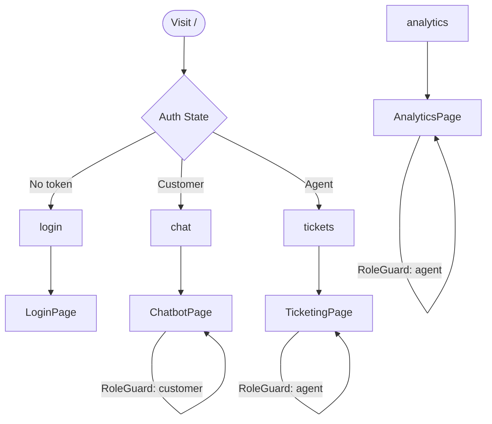
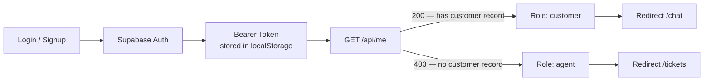

<div align="center">

# Zeni — BFSI Chatbot Frontend

**Customer portal and agent dashboard for the Zeni multi-agent banking chatbot**


[Overview](#overview) · [Interfaces](#interfaces) · [Architecture](#architecture) · [Setup](#getting-started) · [Structure](#project-structure)

</div>

---

## Overview

The Zeni frontend provides two distinct role-based interfaces on a single React app — a conversational **Customer Portal** for submitting banking concerns, and an **Agent Dashboard** for triaging and monitoring support tickets with emotion analytics.

Authentication is handled via Supabase. Role is derived at login — customers land on the chat interface, agents land on the ticket queue.

---

## Interfaces

### Customer Portal — `/chat`

A conversational UI where customers submit concerns and receive real-time responses from the Zeni agent pipeline.

- Sends messages to the backend orchestrator and streams replies
- Displays inline **ticket confirmation cards** when a case is created (ticket ID, issue type, status, case summary)
- Supports the card-block **YES/NO confirmation flow** for P1 critical cases
- Handles informational queries via RAG — no ticket created

### Agent Dashboard — `/tickets` and `/analytics`

A pre-triaged support queue and analytics suite for bank agents.

- **Ticket queue** — sortable table with priority indicators (P1/P2/P3), issue type, customer details, card-block status, and ticket mode
- **Emotion badges** — per-ticket emotion label and intensity derived from the customer's most recent message
- **Conversation history** — expandable per-ticket view showing the full message arc with emotion indicators
- **Operations analytics** — ticket volume trend, priority breakdown, issue-type distribution, response mode distribution, session summary, top customers
- **Emotion analytics** — emotion distribution, daily trend, high-intensity summary, emotion by issue type

---

## Architecture

### Routing



### Auth Flow



---

## Tech Stack

| Layer | Technology |
|---|---|
| Framework | React 19 + TypeScript |
| Build | Vite 8 (Oxc-based React plugin) |
| Styling | Tailwind CSS 3 — Material 3 design tokens, Inter font |
| Routing | React Router 7 |
| Charts | Recharts 3 |
| Auth | Supabase (email/password) |
| API | Centralized `apiFetch` client with Bearer token injection |

---

## Getting Started

### Prerequisites

- Node.js 20+
- The backend running (see [banking-chatbot-backend](../banking-chatbot-backend))
- A Supabase project

### Installation

```bash
git clone <repo-url>
cd banking-chatbot-frontend
npm install
```

### Environment

```bash
cp .env.example .env
# Fill in your values
```

| Variable | Required | Description |
|---|---|---|
| `VITE_API_BASE_URL` | Yes | Backend base URL — default `http://localhost:3000` |
| `VITE_SUPABASE_URL` | Yes | Your Supabase project URL |
| `VITE_SUPABASE_ANON_KEY` | Yes | Supabase anon key |

### Running

```bash
# Development — hot reload
npm run dev

# Production build
npm run build

# Preview production build
npm run preview

# Lint
npm run lint
```

---

## Project Structure

```
src/
├── api/                  # API client modules
│   ├── client.ts         # Generic fetch wrapper with auth header injection
│   ├── auth.api.ts       # Login, signup, getMe
│   ├── chat.api.ts       # Chat session and messaging
│   ├── tickets.api.ts    # Ticket data
│   └── analytics.api.ts  # Operations and emotion analytics
├── components/
│   ├── auth/
│   │   └── RoleGuard.tsx # Redirects on role mismatch
│   ├── layout/
│   │   ├── AppShell.tsx  # Page wrapper with navbar
│   │   └── Navbar.tsx
│   └── ui/               # Primitive components — Badge, Button, Card, Input, Spinner
├── config/
│   └── env.ts            # VITE_* env var exports
├── context/
│   └── AuthContext.tsx   # Auth state, token rehydration, login/logout
├── features/
│   ├── agent/
│   │   ├── EmotionBadge.tsx        # Emotion label + intensity chip
│   │   └── TicketConversation.tsx  # Per-ticket conversation history
│   ├── chat/
│   │   ├── ChatInput.tsx           # Message input bar
│   │   ├── ChatMessage.tsx         # Individual message bubble
│   │   ├── TicketCard.tsx          # Inline ticket confirmation card
│   │   └── useChatSession.ts       # Chat state and message sending hook
│   └── ticketing/
│       ├── CustomerBlock.tsx       # Customer info display
│       ├── TicketFilters.tsx       # Priority / status filter bar
│       ├── TicketRow.tsx           # Expandable ticket row
│       ├── TicketTable.tsx         # Ticket queue table
│       └── useTickets.ts           # Ticket data fetching hook
├── hooks/
│   └── useAuth.ts        # Auth context consumer hook
├── pages/
│   ├── LoginPage.tsx
│   ├── SignUpPage.tsx
│   ├── ChatbotPage.tsx
│   ├── TicketingPage.tsx
│   └── AnalyticsPage.tsx
├── router/
│   └── AppRouter.tsx     # Route definitions and auth redirect logic
├── types/                # Shared TypeScript interfaces
└── utils/                # Formatters, ticket sort helpers
```

---

<div align="center">

Private — Kyla Mae Valoria · Polytechnic University of the Philippines, 2026

</div>
